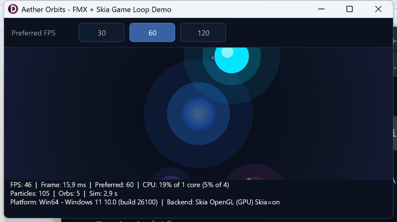

# Aether Orbits

[](LICENSE)
[](https://www.embarcadero.com/products/delphi)
[](https://docwiki.embarcadero.com/RADStudio/en/FireMonkey)
[](docs/FMX-Skia-Gotchas.md)
[](#platforms--backends)
[](docs/GameLoop.md)
[](https://github.com/omonien/AetherOrbits/releases)
[](https://github.com/omonien/AetherOrbits/stargazers)

Two **Delphi 13** FireMonkey demos sharing one Display Link game loop — rendered with **Skia**, no third-party game engine:

| Demo | Project | What it shows |
|------|---------|----------------|
| **Aether Orbits** | `src/AetherOrbits.dproj` | Glowing orbs, particle field, Preferred FPS |
| **Helios** | `src/Helios/Helios.dproj` | Soft-3D solar system, sim speed, pause, trails, click-to-focus |

---

## What you get when you run it



<sub>≈8s screen capture · [MP4 (higher quality, ~200&nbsp;KB)](docs/images/aether-orbits-demo.mp4) · [still PNG](docs/images/aether-orbits-demo.png)</sub>

- An atmospheric particle field with orbiting orbs.
- A **dark stats footer**: FPS, frame time, process CPU, particle counts, platform, and active Skia/FMX backend.
- A **Preferred FPS** control (30 / 60 / 120) so you can see how the display link and pacing behave on your device.
- Smooth animation driven by FMX’s **Display Link** (Delphi 13), not a coarse `TTimer`.

Use it as a playable reference for “how do I do a clean frame loop + Skia drawing in FMX?”

---

## Quick start

### 1. Clone (with tests submodule)

```bash
git clone --recurse-submodules https://github.com/omonien/AetherOrbits.git
cd AetherOrbits
```

If you already cloned without submodules:

```bash
git submodule update --init --recursive
```

### 2. Open in the IDE

Open **`AetherOrbits.groupproj`** in RAD Studio / Delphi 13.

- Aether Orbits: `src/AetherOrbits.dproj`
- Helios (solar system): `src/Helios/Helios.dproj`
- Tests (both demos): `tests/AetherOrbits.Tests.dproj`

Select a platform (e.g. **Win64**, **OSX64**, **iOS Device 64-bit**) and run.

### 3. Command-line build (Windows)

```powershell
.\build-scripts\DelphiBuildDPROJ.ps1 -Project src\AetherOrbits.dproj -Platform Win64 -Config Debug
.\build-scripts\DelphiBuildDPROJ.ps1 -Project src\Helios\Helios.dproj -Platform Win64 -Config Debug
.\build-scripts\DelphiBuildDPROJ.ps1 -Project tests\AetherOrbits.Tests.dproj -Platform Win64 -Config Debug
.\build\Win64\Debug\AetherOrbits.Tests.exe
```

Output goes to `build/<Platform>/<Config>/` (git-ignored).

---

## Using Aether Orbits

| Control | Action |
|---------|--------|
| **Mouse / touch move** | Repels nearby particles (soft force field under the pointer) |
| **Click / tap** | Spawns a short particle burst at the pointer |
| **Preferred FPS** (top bar) | Request 30, 60, or 120 frames per second |
| **Stats footer** | Live FPS, frame ms, Preferred value, CPU, platform, render backend |

## Using Helios (solar system)

Same frame pipeline (`TGameLoop` + Skia), different scene: a soft-3D solar system (Sun + 8 planets) with perspective projection, orbital trails, and a focus camera.

| Control | Action |
|---------|--------|
| **Click / tap a body** | Smooth camera focus on that body + info panel |
| **Click empty space** / **Overview** | Reset camera to system overview |
| **Speed** (0.25× / 1× / 5× / 20×) | Simulation time scale |
| **Pause / Resume** | Freeze orbits (camera ease still runs) |
| **Trails** | Toggle orbital trail ribbons |
| **Preferred FPS** | Same Display Link pacing as Aether Orbits |
| **Stats footer** | FPS, frame ms, sim speed %, body count, platform, backend |

### Preferred FPS — what to expect

| Setting | Typical result |
|---------|----------------|
| **30** | ~30 FPS (paced; useful to save work or compare) |
| **60** | Default — matches most panels and FMX’s default preferred rate |
| **120** | Up to 120 only on ProMotion / 120 Hz displays; otherwise capped by the panel |

On **iPhone 16 (non-Pro)** the panel is **60 Hz** — choosing 120 will not go above ~60.  
On **Windows**, the OS display link often stays at monitor refresh; the demo **paces** the game loop so Preferred 30 still measures ~30 FPS in the footer.

---

## Platforms & backends

| Platform | Notes |
|----------|--------|
| **Windows 64** | Skia via OpenGL (or GPU path) when PreferRaster is off at startup |
| **macOS** | Metal enabled for Skia GPU (`GlobalUseMetal`) |
| **iOS** | Same Display Link / Metal path; responsive stats HUD for narrow screens |

The footer’s **Backend** line shows what is actually active (e.g. Skia Metal, Skia OpenGL, Skia Raster).

Startup flags that matter are set in `src/AetherOrbits.dpr` (Skia on; Windows PreferRaster off; Metal on for Apple). Details and pitfalls: **[docs/FMX-Skia-Gotchas.md](docs/FMX-Skia-Gotchas.md)**.

---

## Reuse the game loop in your own app

The frame clock is a **single, standalone unit** with no dependency on the demo scene or Skia:

**[`src/AetherOrbits.GameLoop.pas`](src/AetherOrbits.GameLoop.pas)**

1. Copy the unit into your FMX project.  
2. Create a `TGameLoop`, assign `OnUpdate` / `OnRender`.  
3. Call `StartLoop` when the form is shown (`Root` must be set — parent the loop to the form).

### Code quickstart

```pascal
uses
  AetherOrbits.GameLoop;

type
  TFormMain = class(TForm)
    procedure FormCreate(Sender: TObject);
    procedure FormDestroy(Sender: TObject);
    procedure FormShow(Sender: TObject);
  private
    FGameLoop: TGameLoop;
    procedure DoUpdate(const ADeltaTime: Double);
    procedure DoRender;
  end;

procedure TFormMain.FormCreate(Sender: TObject);
begin
  // Owner = form → Parent is set so Root <> nil (required for Display Link).
  FGameLoop := TGameLoop.Create(Self);
  FGameLoop.OnUpdate := DoUpdate;
  FGameLoop.OnRender := DoRender;
  // Optional: FGameLoop.FixedTimeStep := 1 / 60;  // simulation step only
end;

procedure TFormMain.FormShow(Sender: TObject);
begin
  // Start when visible — not only in OnCreate.
  if not FGameLoop.Running then
    FGameLoop.StartLoop;
end;

procedure TFormMain.FormDestroy(Sender: TObject);
begin
  FGameLoop.StopLoop;
  // FGameLoop is owned by Self; no Free needed if Owner = Self
end;

procedure TFormMain.DoUpdate(const ADeltaTime: Double);
begin
  // Called 0..N times per display frame with a *fixed* step (default 1/60 s).
  // This is the "brain" of the demo — advance the world, not the pixels:
  //
  //   Player.X := Player.X + Player.SpeedX * ADeltaTime;
  //   for each enemy: move, collide, score…
  //   ParticleSystem.Step(ADeltaTime);
  //
  // Keep this free of drawing code so the sim stays deterministic and testable.
end;

procedure TFormMain.DoRender;
begin
  // Called once per processed frame *after* updates. Only "show the result":
  //
  //   PaintBox.Redraw;          // or Invalidate;
  //   // …and in OnDraw / Paint: draw sprites, HUD, background from current state
  //
  // Do not advance physics here — that belongs in DoUpdate.
end;
```

**Pitfalls**

| Issue | Fix |
|-------|-----|
| Scene freezes after first frame | `Root` was nil — pass the form as `Owner` (or set `Parent`) and call `StartLoop` from **OnShow** |
| Preferred FPS 30 does nothing on Windows | Set `GlobalPreferredFramesPerSecond` (and keep `PaceToPreferredFps` true — default); see [docs/GameLoop.md](docs/GameLoop.md) |
| Simulation too fast/slow | Change **`FixedTimeStep`**, not Preferred FPS |

Deep dive: **[docs/GameLoop.md](docs/GameLoop.md)**  
(Display Link vs Preferred FPS vs fixed simulation timestep, Windows DWM pacing, etc.)

---

## Project layout

```
AetherOrbits/
├── src/
│   ├── AetherOrbits.*      # Orbs / particles demo
│   └── Helios/             # Solar-system demo (reuses GameLoop + HUD)
├── tests/                  # DUnitX unit + form smoke tests (both demos)
├── build-scripts/          # DelphiBuildDPROJ.ps1
├── docs/
│   ├── images/             # README demo GIF / MP4 / still
│   ├── GameLoop.md         # Loop design & FPS concepts
│   ├── FMX-Skia-Gotchas.md # Platform/Skia gotchas
│   └── Delphi Style Guide EN.md
├── libs/DUnitX/            # Git submodule
├── AetherOrbits.groupproj
├── LICENSE                 # MIT
└── README.md
```

### Architecture (short)

| Layer | Unit | Role |
|-------|------|------|
| Timing | `AetherOrbits.GameLoop` | Display Link + fixed timestep + Preferred pacing (**shared**) |
| Simulation | `AetherOrbits.Scene` / `Helios.Scene` | Demo state — no UI, no Skia |
| Drawing | `*.Scene.Renderer` | Skia paint of scene state |
| Diagnostics | `AetherOrbits.SystemInfo` | Platform, backend, CPU samples (**shared**) |
| HUD | `AetherOrbits.Stats.Hud` | Footer text + Skia overlay (**shared**) |
| Shell | `*.Main.Form` | Form chrome, controls, paint box wiring |

Skia draws pixels; it does **not** own the frame clock. The loop does not know about orbs, planets, or Skia.

---

## Requirements

- **Delphi 13** (Florence) or newer — Display Link–driven `TAnimation`
- **Integrated Skia** for the demo renderer (not required by `GameLoop` itself)
- **Git** with submodule support for DUnitX tests
- Optional: macOS / iOS deploy targets and signing as usual for FMX

---

## Documentation

| Doc | Audience |
|-----|----------|
| [docs/GameLoop.md](docs/GameLoop.md) | Reusing / understanding `TGameLoop` |
| [docs/FMX-Skia-Gotchas.md](docs/FMX-Skia-Gotchas.md) | Metal, PreferRaster, Root, HUD under Skia |
| [docs/Delphi Style Guide EN.md](docs/Delphi%20Style%20Guide%20EN.md) | Coding conventions used in this repo |

---

## License

Copyright © 2026 Olaf Monien. Released under the **[MIT License](LICENSE)**.
